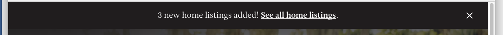

# react-notification-bar

A React notification bar



## Usage

```
import React from 'react';
import ReactDOM from 'react-dom';
import NotificationBar from 'react-notification-bar';


let bar = React.createElement(
    NotificationBar,
    {
        message: 'Free Chickens!',
        sound: true,
    }
);

ReactDOM.render(bar, '#notification-bar');

```
